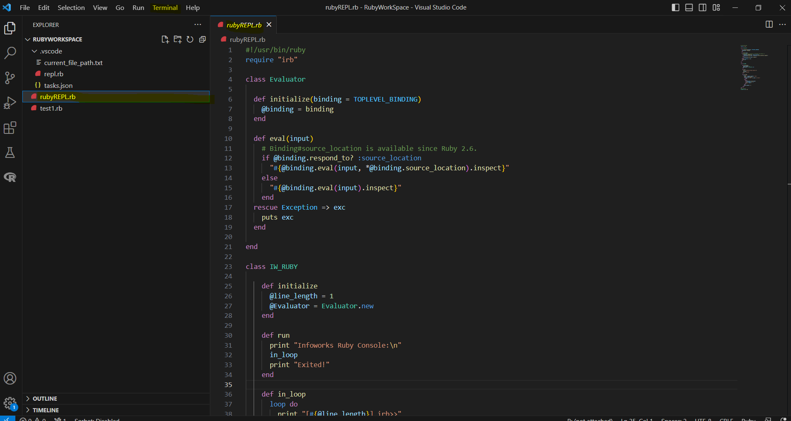
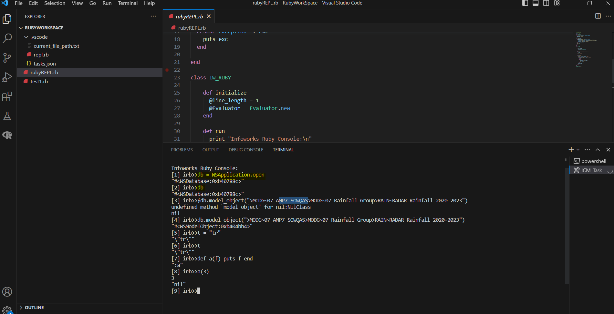

# Command line ruby
use Infoworks ICM/ Infoworks WSPro ruby on command line using simple REPL.
## How to run.
1) Download the folder and open folder it in vscode.
2) open rubyREPL.rb file.
   
4) Run the build task
   
  Terminal -> run build task -> REPL
## Exit the terminal
To exit the termial you can use "exit" function.
